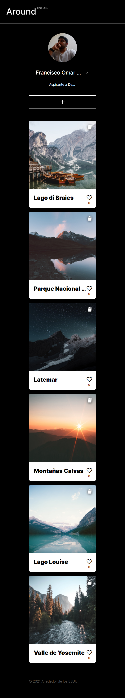
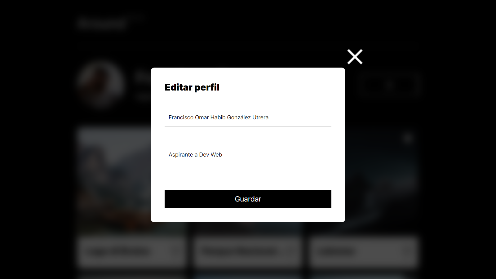
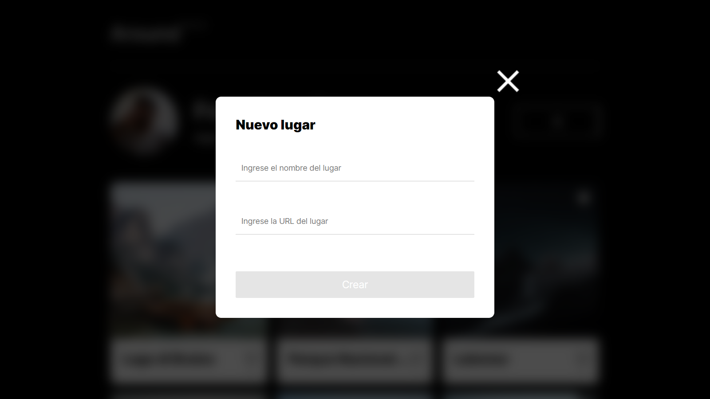
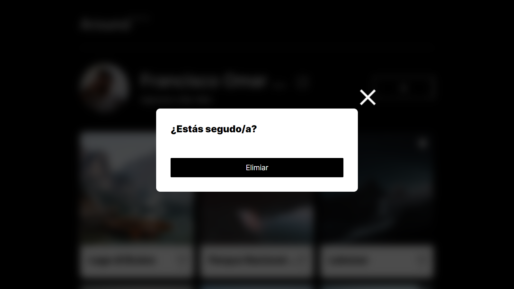

# Proyecto 4: Alrededor de los Estados Unidos

## Descripción general

- Introducción
- Vistas previas del proyecto
- Vistas JavaScrip aplicado
- Nota
- Autor

## Introducción

Este proyecto es el resultado de lo aprendido de los sprints: 1, 2 y 3 del bootcamp **Practicum** que estoy cursando actualmente, en donde aplique los aprendidos y mejorados ya adquiridos, como flex-box, Grid Layout, metodología bem, transiciones, animaciones, buena maquitación, etc además de los nuevos conocimientos del sprint 4 introducción a JavaScript como lo son:

- Declaración de variables.
- Declaración y llamado de Funciones.
- La manipulación de elementos del árbol DOM: nodos, elementos, atributos, etc.
- Trabajar con clases para los elementos del DOM: className, classList, id, etc.
- Eventos en especifico addEventListener("click", funtion-name).

## Vistas previas del diseño responsivo proyecto

### Vistas diseño pc min-width 1024px

### Vistas diseño para tablets min-width 768px y max-width 1024px

### Vistas diseño para dispositivos móviles max-width 768px

## Vistas JavaScrip aplicado

### Vista pc

### Vista tablets

### Vistas dispositivos móviles

## Nota

Toda la página web fue diseñado, en base al documentos proporcionado por el bootcamp, para la realicación del proyecto.

- [Enlace al proyecto en Figma utilizado.](https://www.figma.com/file/zXzLVGc4KNVm3FMTsAnQnH/WEB%2C-Sprint-4%3A-Alrededor-de-los-EEUU-%7C-desktop-%2B-mobile?node-id=0-1&t=4NePpZYhpOSuxWfA-0)

Para ver el resultado del proyecto publicado en github pages, da click al siguiente enlace.

- [Enlace al citio web.](https://frank345-sys.github.io/web_project_4_esp/)

## Autor

Francisco Omar Habib González Utrera 2023
